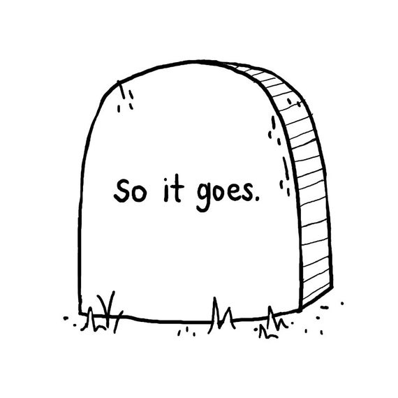

# **Welcome to Yossshhhh's Homepage**
In the words of Kurt Vonnegut, one of my favorite authors:

## **About Me**
Hi, I'm Adam! I'm currently a third year student at UC San Diego studying Cognitive Science w/ specialization in Machine Learning and minoring in Computer Science. I'm interested in Software Engineering, Data Science, as well as Computer Security. In my free time, I like to play hockey, read/write ~~sadtire~~ satire, and run. I also drive buses at UCSD.

## **Cool Commands**
>This section is also in progress and will be updated regularly.

Use `nc towel.blinkenlights.nl` to watch Star Wars Episode IV in the terminal!

## **Projects**
>In progress :)

## **Coursework**
- Computer Organization and Systems Programming
- Advanced Data Structures
- Design and Analysis of Algorithms
- Software Engineering
- Data Science in Practice

## **Get to Know Me Better**
[LinkedIn](https://www.linkedin.com/in/adam-yoshinaga-744914154/)

[The MQ](http://themq.org/author/ayoshinaga/)

